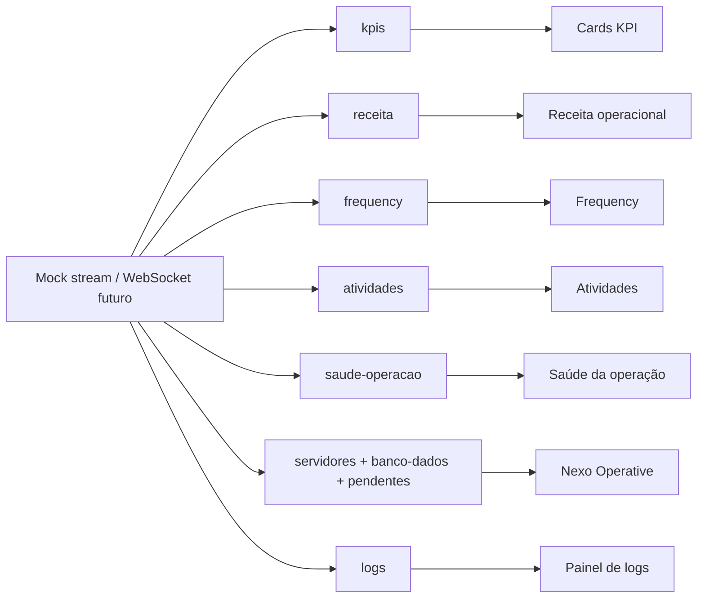

# Arquitetura evolutiva

## Estado atual

O produto roda como um host React/Vite com uma API FastAPI. O host concentra autenticação JWT, navegação, tema, notificações, auditoria e as telas de domínio. Isso mantém o deploy simples para o estágio atual.

## Alvo de micro-frontends

A estratégia recomendada é Module Federation via Vite quando houver times e deploys independentes. Antes disso, cada domínio deve respeitar contratos de eventos e componentes para que a extração seja incremental.

```mermaid
flowchart LR
  Host[Shell / Host\nAuth + Router + Theme] --> Bus[Event Bus\nCustom Events]
  Host --> DS[@empresa/ui-kit\nDesign Tokens + Components]
  Host --> Dashboard[mf-dashboard]
  Host --> Analytics[mf-analytics]
  Host --> Wallet[mf-wallet-financeiro]
  Host --> Tables[mf-tabelas]
  Host --> Settings[mf-configuracoes]
  Host --> Notifications[mf-notificacoes]
  Dashboard --> API[API Gateway / FastAPI]
  Analytics --> API
  Wallet --> API
  Tables --> API
  Settings --> API
  Notifications --> API
```

Estrutura proposta:

```text
apps/
  shell-host/
  mf-dashboard/
  mf-analytics/
  mf-wallet-financeiro/
  mf-tabelas/
  mf-configuracoes/
  mf-notificacoes/
packages/
  ui-kit/
  contracts/
  event-bus/
```

## Contratos

- O shell publica `nexo:auth-changed`, `nexo:tenant-changed` e `nexo:theme-changed`.
- Módulos publicam `nexo:navigate`, `nexo:toast` e `nexo:report-exported`.
- Props de montagem: `accessToken`, `tenantId`, `navigate`, `emit` e `onError`.
- Cada módulo deve expor `mount(container, contract)` e `unmount(container)`.
- O pacote `contracts` deve ser versionado e validado no CI antes do deploy.

## Sequência de migração

1. Extrair tokens e componentes compartilhados para `packages/ui-kit`.
2. Extrair notificações e tabelas, que já possuem limites de domínio claros.
3. Extrair analytics/dashboard com lazy loading e Module Federation.
4. Separar wallets e configurações após estabilizar contratos de API.
5. Publicar cada módulo com pipeline independente e testes de contrato.

A migração não deve ser feita em um único corte: o host atual continua sendo o fallback enquanto cada módulo é extraído e validado.

## Nexo Operative

Rotas deep-linkáveis no host atual:

| Rota | Responsabilidade |
| --- | --- |
| `#/operative` | Saúde geral, uptime, serviços e alertas |
| `#/operative/servers` | Servidores, teste de conexão e detalhe técnico |
| `#/operative/database` | Conexões, inserção validada, extração JSON e consulta segura |
| `#/operative/pending` | Fila de aprovação, reprocessamento e filtros |
| `#/operative/query` | Consulta cruzada e exportação do resultado |

Status padronizados: `Operacional` (verde), `Atenção` (amarelo), `Crítico` (vermelho) e `Inativo` (cinza). Cada linha exibe o último check ou sincronização e pode abrir detalhe técnico.

As ações de escrita/teste exigem confirmação, mostram loading e feedback, registram auditoria quando autenticadas e têm estado de falha explícito.

## Streaming em tempo real

O ambiente de desenvolvimento usa [`src/realtime.js`](../src/realtime.js) como simulador de stream. Ele mantém uma assinatura independente por canal, pausa/retoma, reconexão simulada com backoff e eventos de log.



Canais ativos: `kpis`, `receita`, `frequency`, `atividades`, `saude-operacao`, `servidores`, `banco-dados`, `pendentes` e `logs`. O simulador é substituível por WebSocket/SSE sem mudar os componentes consumidores.
