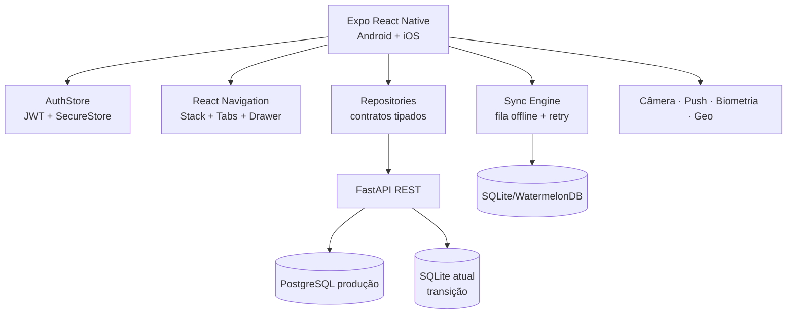

# Arquitetura Mobile do Nexo RPPS

## Decisão técnica

A recomendação para este produto é **React Native com Expo e TypeScript**, não Flutter, por três motivos:

1. O cliente atual já usa React/Vite e possui regras de apresentação, autenticação e contratos que podem ser reaproveitados em pacotes agnósticos de UI.
2. O backend FastAPI já oferece uma API REST estável para login, tenant, segurados, integrações, notificações, auditoria, configurações e uploads.
3. Expo reduz o risco operacional de câmera, notificações push, armazenamento seguro, biometria e builds Android/iOS.

A UI desktop não deve ser portada pixel a pixel. O domínio e os serviços são compartilhados; a experiência mobile será desenhada para toque, operação em campo e conectividade intermitente.

## Estado atual identificado

- Frontend: React 18 + Vite, atualmente concentrado em `src/App.jsx`.
- Backend: FastAPI/Uvicorn em `backend/app.py`.
- Persistência: SQLite no backend (`backend/nexo.db`), uploads locais.
- Identidade: JWT, RBAC, tenant switch, auditoria e notificações.
- Domínios: Dashboard, segurados, qualidade, integrações, compliance/auditoria, relatórios, recadastramento e Nexo Operative.

## Arquitetura alvo



### Camadas

```text
mobile/
  app/                  # Expo Router ou React Navigation
  features/
    auth/
    dashboard/
    segurados/
    qualidade/
    integracoes/
    compliance/
    relatorios/
    recadastramento/
    nexo-operative/
  shared/
    api/                # cliente HTTP, refresh, erros
    auth/               # sessão e permissões
    storage/            # SecureStore + banco local
    sync/               # fila, conflitos, backoff
    ui/                 # componentes mobile do design system
    telemetry/          # auditoria, logs e métricas
packages/
  domain/               # regras e tipos sem React
  api-contracts/        # DTOs versionados
  design-tokens/        # tokens Dotal/Nexo
```

## Navegação mobile

- **Bottom tabs:** Visão geral, Segurados, Pendentes, Operativo, Mais.
- **Drawer:** Integrações, Qualidade, Relatórios, Compliance, Configurações e logout.
- **Stack de detalhe:** lista → ficha do segurado → documentos/auditoria.
- **Nexo Operative:** Operação → Servidores, Banco, Pendentes e Consulta.
- Cada rota deve ser deep-linkável, por exemplo `nexo://operative/servers`.
- Tabelas desktop viram cards com ações por swipe ou menu contextual; paginação vira cursor/infinite scroll.

## Fluxos preservados

### Login e sessão

1. `POST /api/auth/login` retorna JWT e contexto do usuário.
2. Token fica em `expo-secure-store`, nunca em AsyncStorage.
3. `GET /api/auth/me` valida a sessão ao abrir o app.
4. Expiração encaminha para login e preserva uma ação pendente segura, sem persistir senha.
5. Ações críticas exigem biometria ou reautenticação.

### Cadastro de segurado

- Tela dividida em etapas: identificação, benefício/ente, documentos e revisão.
- Validação local imediata e validação final na API.
- Upload de documento usa câmera/galeria, compressão, fila offline e retomada.
- Ação de salvar cria uma operação idempotente e aparece na fila de sincronização.

### Nexo Operative

- Cards de saúde viram resumo vertical com status semântico.
- Servidores e bancos usam lista virtualizada, atualização pull-to-refresh e stream quando disponível.
- Pendências têm ações grandes para toque, confirmação e feedback persistente.
- Consulta usa filtros estruturados, chips e resultado paginado; SQL livre continua proibido.

## Offline-first e sincronização

SQLite local/WatermelonDB deve ser introduzido no mobile para dados de leitura e fila de escrita. Cada mutação recebe:

```text
operation_id, entity, entity_id, action, payload, created_at, retry_count, status
```

Regras:

- GET usa stale-while-revalidate.
- Escritas ficam em `queued` quando offline.
- Retry exponencial com limite e jitter.
- `operation_id` é enviado ao backend para idempotência.
- Conflitos usam versão/`updated_at`; nunca sobrescrever silenciosamente.
- Uploads grandes usam partes, checksum e retomada.
- O usuário vê sincronizado, pendente, conflito ou falhou em cada item.

O SQLite atual deve permanecer apenas como transição de backend. Para produção multiusuário, migrar para PostgreSQL gerenciado e manter SQLite somente para testes locais ou edge controlado.

## Contratos de API necessários

Manter os endpoints atuais e evoluir respostas para DTOs versionados:

- `POST /api/auth/login`, `GET /api/auth/me`
- `GET/POST /api/context`
- `GET/PUT /api/segurados/{id}`
- `GET /api/integrations`, `GET /api/notifications`
- `POST /api/notifications/{id}/read`
- `GET/PUT /api/settings`
- `POST /api/uploads`
- `GET /api/audit`, `POST /api/audit/action`
- `GET /api/segurados/export.csv`

Adicionar antes do lançamento mobile:

- `POST /api/auth/refresh`
- `POST /api/auth/revoke`
- `GET /api/sync/changes?cursor=`
- `POST /api/sync/mutations`
- `POST /api/uploads/{id}/complete`
- `GET /api/operative/servers`
- `GET /api/operative/databases`
- `GET /api/operative/pending`
- WebSocket/SSE por tenant para métricas e status

## Recursos nativos

| Recurso | Uso no Nexo RPPS | Permissão/controle |
| --- | --- | --- |
| Câmera | Captura de RG, comprovantes e QR Code | consentimento, recorte e remoção de metadados |
| Push | Pendência crítica, falha de integração e aprovação | preferências por severidade |
| Biometria | Reautenticar exportação, alteração e ações destrutivas | fallback para senha |
| Geolocalização | opcional para check-in de atendimento em campo | desligado por padrão, consentimento explícito |
| Compartilhamento | enviar relatório/exportação | dados mascarados por padrão |
| Haptics | confirmação de ação e erro | discreto, configurável |

## Segurança e conformidade

- TLS obrigatório e certificate pinning apenas após operação de rotação definida.
- SecureStore para tokens; nenhum segredo em logs.
- RBAC vindo do backend; o mobile apenas esconde ações e nunca substitui autorização server-side.
- CPF e documentos mascarados em notificações, logs e screenshots.
- Timeout de sessão e reautenticação para exportação, uploads e alterações.
- Telemetria sem dados pessoais; consentimento e retenção documentados para LGPD.

## Plano de migração

1. **Fundação:** extrair `domain`, `api-contracts`, tokens e cliente HTTP do desktop.
2. **Shell mobile:** Expo, autenticação, SecureStore, navigation e estados offline.
3. **Leitura:** Dashboard, segurados e notificações com cache local.
4. **Operação:** Pendentes, qualidade e Nexo Operative.
5. **Escrita:** formulários em etapas, uploads, fila e conflitos.
6. **Recursos nativos:** câmera, push, biometria e compartilhamento.
7. **Hardening:** testes E2E em Android/iOS, acessibilidade, crash reporting, distribuição interna.
8. **Produção:** PostgreSQL, refresh/revogação, sync incremental, WebSocket/SSE e rollout gradual.

## Critérios de aceite

- Login, logout, troca de tenant e expiração preservam as regras atuais.
- Toda escrita funciona online e offline com feedback de sincronização.
- Nenhum dado pessoal é exposto em push ou log.
- Ações críticas exigem confirmação e autorização do backend.
- Testes unitários cobrem domínio; integração cobre login/sync/upload; E2E cobre fluxos de campo.
- Android e iOS passam por matriz de acessibilidade, rede lenta, modo offline e retomada após suspensão.
